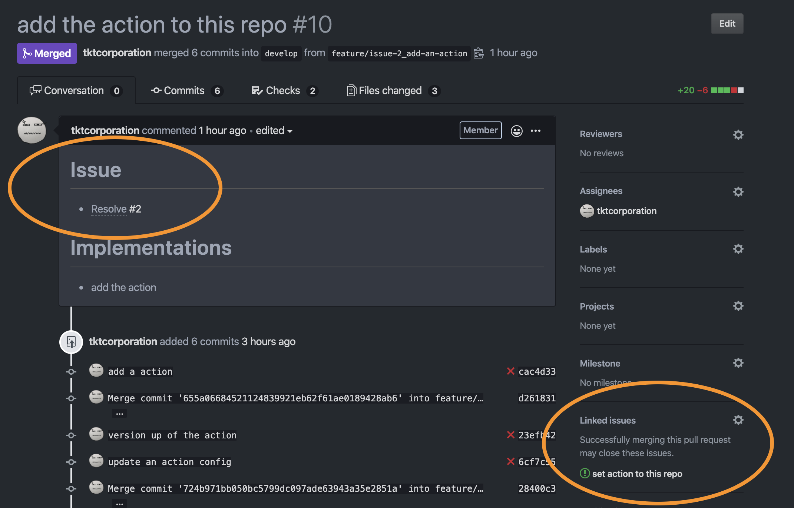

# Add Issue Links

A GitHub Action for [Linking a pull request to an issue](https://help.github.com/en/enterprise/2.17/user/github/managing-your-work-on-github/linking-a-pull-request-to-an-issue).

## :arrow_forward: Usage

This action add a comment or add texts into a body of Pull Request like this when it is opened.

```md
# Related Issue

- Resolve #2
```

- Result Sample
  

### Create a workflow

Create `.github/workflows/issue-link.yml`.

#### issue-link.yml

```yml
name: 'Issue Links'
on:
  pull_request:
    types: [opened]

jobs:
  issue-links:
    runs-on: ubuntu-latest
    # https://docs.github.com/en/actions/security-guides/automatic-token-authentication#permissions-for-the-github_token
    permissions:
      pull-requests: write
    steps:
      - uses: tkt-actions/add-issue-links@v1.8.1
        with:
          repo-token: '${{ secrets.GITHUB_TOKEN }}' # required
          branch-prefix: 'issue-' # required
```

### Set up required parameters

Need to contain the required parameters on the workflow file.

- `repo-token` - A token of the repository.  
  It can pass with `{{ secrets.GITHUB_TOKEN }}`

### Set up optional parameters

- `branch-prefix` - A prefix of a branch name for finding a related issue. The regex can be used.
  (Default: "issue-")
- `position` - Change position of link text section.  
  (allow "top" or "bottom". Default: "bottom")
- `header` - Change header of link text section.  
  (Default: "# Related Issue")
- `resolve` - Add "Resolve" prefix to close a related issue when the branch is merged.  
  (allow "true" or "false". Default: "false")
- `resolve-word` - Set a prefix for resolving an issue to some specified.
  This works when the `resolve` option is enabled.
  (Default: "Resolve")
- `repository` - Change a base repository related to an issue.  
  If you use this option, "resolve" option become false.  
  (e.g. `tkt-actions/issue-links`)
- `link-style` - `body` add an issue link by editing Pull Request body.  
  `comment` add an issue link by creating comment to Pull Request.  
  (allow "body or "comment". Default: "body")

#### Body edit example

- Add an issue link to Pull Request body.
- Use branch prefix `/`. A branch name example `feature/10/update`.
- Set an issue repository.

```yml
name: 'Issue Links'
on:
  pull_request:
    types: [opened]

jobs:
  issue-links:
    runs-on: ubuntu-latest
    permissions:
      pull-requests: write
    steps:
      - uses: tkt-actions/add-issue-links@v1.8.1
        with:
          repo-token: '${{ secrets.GITHUB_TOKEN }}'
          branch-prefix: '/'
          repository: 'tkt-actions/add-issue-links'
```

#### Comment link example

- Add an issue link as a comment
- Resolve issue when a pull request is merged.
- Use branch prefix `issue-`. A branch name example `feature/issue-10/update`.

```yml
name: 'Issue Links'
on:
  pull_request:
    types: [opened]

jobs:
  issue-links:
    runs-on: ubuntu-latest
    permissions:
      pull-requests: write
    steps:
      - uses: tkt-actions/add-issue-links@v1.8.1
        with:
          repo-token: '${{ secrets.GITHUB_TOKEN }}' # required
          branch-prefix: 'issue-' # required
          resolve: 'true' # optional (default: "false")
          link-style: 'comment' # optional (default: "body")
```

#### Other examples

- https://github.com/tkt-actions/add-issue-links/tree/master/.github/workflows

### Add a section contained a link of related issue to a pull request

Create a branch based on the pattern of the branch name (`[branch prefix][issue number][you can put any texts]`) set up on `.github/workflows/issue-reference.yml`.

For example, if `branch-prefix` is `issue-`, create a branch like `issue-8/create-action`.

When pushing your changes to the repository and creating a pull request, a workflow runs automatically.

## :memo: Licence

MIT
